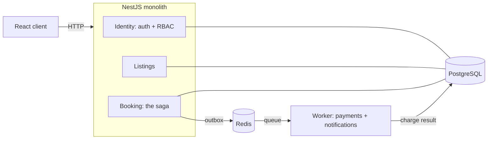
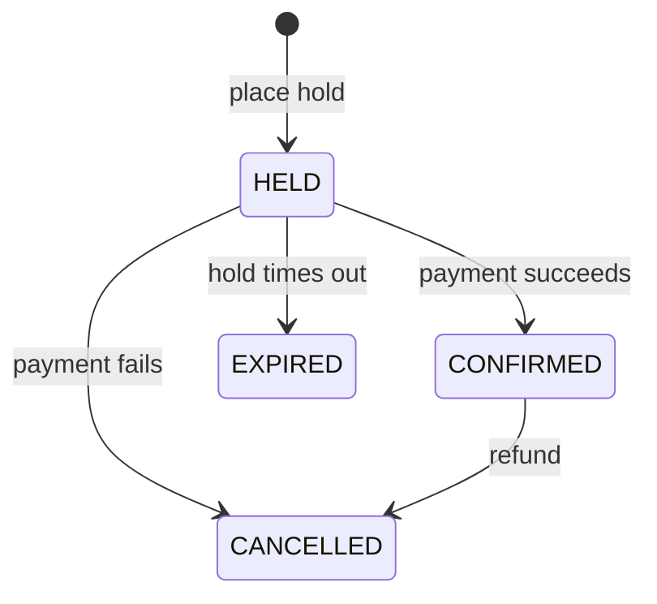

# noOverlap

**[nooverlap.ashfak.dev](https://nooverlap.ashfak.dev)** — sign in as `guest@demo.nooverlap.app`
with the password `demo-guest-2026` to skip registration. Book something and leave the page alone:
the hold confirms itself when the charge settles in another process, which is the whole architecture
visible in about two seconds.

A booking platform built around one hard guarantee: **a listing can never be double-booked, no matter
how many people try to reserve the same dates at the same instant.** Most reservation systems treat
that as an edge case. Here it is the organizing problem, and the answer is proven with a test rather
than asserted in a paragraph.

Ten thousand concurrent booking attempts across a hundred contended slots produced a hundred winners
and **zero overlapping reservations**. That number is not a claim about careful application code; it
is a property of the database schema, and it would hold even if the application logic were wrong.

The stack is a NestJS modular monolith with PostgreSQL and Redis, plus one worker process split off at
the single seam where asynchronous work is genuinely justified: charging a card.

## The hard part

Two guests want the same week. Both check availability, both see it free, both book. The obvious
implementation has a race between the check and the write, and no amount of application-level care
closes it — the window is between two statements, and another transaction fits in it.

The usual answers all cost something. Serializing every booking through a lock makes an unrelated
booking wait on an unrelated one. Optimistic retries turn a correctness problem into a livelock under
contention. Application-level checking is the TOCTOU bug itself, written more carefully.

The answer here is to stop checking. A PostgreSQL **exclusion constraint** makes overlap
unrepresentable:

```sql
ALTER TABLE reservations ADD CONSTRAINT no_overlapping_active_reservations
  EXCLUDE USING gist (
    listing_id WITH =,
    tstzrange(check_in, check_out, '[)') WITH &&
  ) WHERE (status IN ('HELD', 'CONFIRMED'));
```

The service does not ask whether the slot is free. It inserts, and handles the rejection. Exactly one
of N racing transactions commits; the rest are refused by the database and become a `409`. Correctness
comes from the constraint, not from the timing of the code around it.

The half-open range `[)` is doing real work too: it makes a checkout and the next day's check-in not
overlap, so back-to-back stays are allowed rather than losing a night between every booking.

The mechanism and the alternatives are in [docs/concepts/no-overlap.md](docs/concepts/no-overlap.md).

## Proof, not adjectives

Two tests, deliberately opposite shapes.

A storm of a hundred simultaneous holds against a single slot returns **one `201` and ninety-nine
`409`s**, and leaves exactly one row. Repeated a hundred times against fresh listings — ten thousand
attempts total — the invariant is then asserted against the entire table rather than the rows the test
created, which is the only version that can catch an overlap involving anything else:

```sql
SELECT count(*) FROM reservations a
JOIN reservations b
  ON a.listing_id = b.listing_id AND a.id < b.id
 AND tstzrange(a.check_in, a.check_out, '[)')
  && tstzrange(b.check_in, b.check_out, '[)')
WHERE a.status IN ('HELD','CONFIRMED') AND b.status IN ('HELD','CONFIRMED')
```

The answer is `0`. Integration tests run against a real PostgreSQL started per run, not a mock — the
guarantee lives in the database, so testing it against anything else would test nothing.

The other guarantee is about money, and it is tested the same way. Delivery across the queue is
at-least-once, so the test forces the duplication rather than hoping it does not happen: three outbox
rows redelivered as **four charge jobs produced exactly one payment**. A redelivered success is a
no-op rather than a second confirmation, a declined card releases the hold, and a message that fails
five backed-off attempts lands in a dead-letter queue instead of looping forever or vanishing. Killing
the worker mid-charge loses nothing, because the intent was committed in the same transaction as the
booking.

## Architecture



The monolith holds the request path, where one database transaction keeps things simple and correct.
The worker owns the one job that must not run inside an HTTP request or a database transaction:
talking to a payment provider.

A **transactional outbox** connects them. The reservation and the intent to charge are written in the
same transaction, so they commit together or not at all — there is no state where a booking exists and
the charge was lost, and none where a charge was queued for a transaction that rolled back. Delivery is
at-least-once, so every step across that boundary is built to be safe to repeat.

The full shape is in [docs/architecture/](docs/architecture/), the seam in
[docs/concepts/async-seam.md](docs/concepts/async-seam.md).

## How a booking works

A reservation is an explicit state machine. A guest places a hold, which reserves the slot for a short
window. Payment confirms it; failure or a timeout releases it.



There is no confirm button anywhere in the interface. A reservation is confirmed by the payment result
arriving from the worker — an endpoint that once let a guest confirm their own booking was removed when
building the client revealed it bypassed payment entirely. Compensation runs the same path in reverse:
releasing a paid booking asks the worker to refund it, keyed by the charge it reverses.

Details in [docs/concepts/booking-lifecycle.md](docs/concepts/booking-lifecycle.md).

## One booking, one trace


Read left to right, that is the whole design. The request writes the reservation and its event in one
transaction and commits. The gap is the relay's polling interval — real latency the outbox costs, worth
seeing rather than hiding. Then `charge` appears under a different service name because it is a
different process, and `settle` crosses back to confirm the booking, still inside the same trace.

Instrumentation follows an HTTP request happily and stops dead at a queue, because the connection ends
there. The context travels in the message instead, captured in the request that made the booking rather
than in the relay that published it seconds later — inject at the relay and one booking becomes two
unrelated traces. [docs/concepts/tracing-a-booking.md](docs/concepts/tracing-a-booking.md) has the rest.

## Measured numbers

Sustained arrival rates against a pool of listings, sixty seconds per rate, tracing disabled. Latency
is the `POST /reservations` response. Backlog is unpublished outbox rows immediately after the run.

| Rate | Bookings | Success |     p50 |     p95 |     p99 | Backlog after |
| ---: | -------: | ------: | ------: | ------: | ------: | ------------: |
| 30/s |    1,801 |    100% | 13.17ms | 19.27ms | 23.93ms |             0 |
| 40/s |    2,401 |    100% | 10.29ms | 20.11ms | 55.18ms |             0 |
| 50/s |    3,001 |    100% |  8.27ms | 21.96ms | 69.32ms |             0 |
| 60/s |    3,601 |    100% |  7.49ms | 15.31ms | 53.15ms |       **494** |

Conditions: Apple M1, 8 cores, 8 GB, with everything — load generator, API, worker, PostgreSQL, Redis —
on the same machine. Dataset ~28,700 reservations across 247 listings. The generator competes with the
system it measures, so these are honestly bounded rather than best-case.

**The endpoint was never the constraint.** p50 *falls* as the rate rises, which is the opposite of a
system under strain; connections stay warm instead of being re-established between sparse requests. The
binding constraint is the outbox relay, and its ceiling is arithmetic — it claims 100 rows every two
seconds, so it publishes 50 events per second and no more. The measurements land exactly on that
boundary: zero backlog at 50/s, accumulating at 60/s.

**The interesting part is that this is invisible from the load tool.** At 60/s the endpoint posted its
*best* p95 of the run while the seam fell 494 events behind. A team watching latency dashboards would
have seen a system in excellent health while work silently piled up. Nothing is lost — the backlog
drains once load subsides — but past 50/s a guest waits longer for confirmation, and that delay grows
for as long as the overload lasts.

Raising the ceiling is a two-constant change, and deliberately not done: a larger batch holds row locks
and a transaction open across a Redis round trip for longer. The right moment to change it is when a
measurement says it binds, which is what this one now says.

## What this does not do

A design document that lists only what flatters it is not a design document.

The endpoint's actual ceiling is unknown. Testing stopped at 60/s because the seam constraint had been
located, not because the API showed strain — "sustains at least 60/s" is the honest claim.

p99 is noisy and should be read as an order of magnitude. Sixty-second runs on a laptop produce
outliers.

The payment provider is a mock with configurable failure and latency, which is what makes the failure
and compensation paths reproducible on demand. Integrating a real one is a provider adapter, not a
redesign — but it is not written.

Production runs without tracing: the backend needs more memory than the instance has. The trace above
documents a local run.

And the deployment is one instance. There is no redundancy, and the realtime layer's Redis fan-out is
built for horizontal scaling it does not currently get.

## Tech

| Layer         | Choice                                                                 |
| ------------- | ---------------------------------------------------------------------- |
| Backend       | NestJS, TypeScript                                                     |
| Database      | PostgreSQL (exclusion constraints, range types)                        |
| ORM           | Prisma, with a raw SQL migration for the exclusion constraint          |
| Queue         | BullMQ on Redis                                                        |
| Realtime      | Socket.IO with a Redis adapter for cross-instance fan-out              |
| Auth          | JWT access + refresh (RS256), Argon2id password hashing                |
| Frontend      | React 19, TanStack Query, Tailwind, React Router                       |
| Observability | OpenTelemetry traces, a Prometheus-format scrape endpoint              |
| Testing       | Jest, Testcontainers, supertest, k6, a bespoke concurrency harness     |
| Deployment    | Multi-stage Docker images built in CI, Compose behind a reverse proxy  |
| Tooling       | Turborepo, pnpm workspaces, GitHub Actions                             |

## Running it locally

```bash
docker compose up -d      # PostgreSQL + Redis
pnpm install
pnpm --filter @no-overlap/db exec prisma migrate deploy
pnpm dev                  # the API and the web client
```

The API serves an OpenAPI document at `/docs`. A Postman collection lives under `postman/`.

The integration suite starts a throwaway PostgreSQL of its own:

```bash
pnpm --filter api test:int
```

## Documentation

- [docs/architecture/](docs/architecture/) — the system shape, the request path, the seams, deployment.
- [docs/concepts/](docs/concepts/) — the ideas behind the core, one page each.
- [docs/architecture/decisions/](docs/architecture/decisions/) — every significant choice and its cost.
- [docs/architecture/operations.md](docs/architecture/operations.md) — deploying, rolling back, reading the seam.
- [docs/glossary.md](docs/glossary.md) — the vocabulary in one place.
