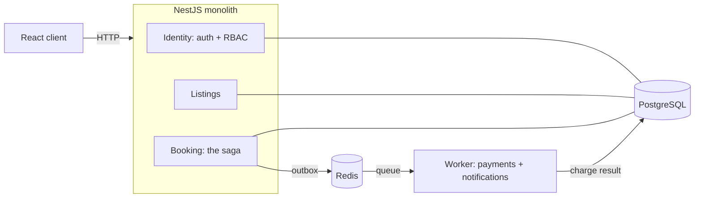
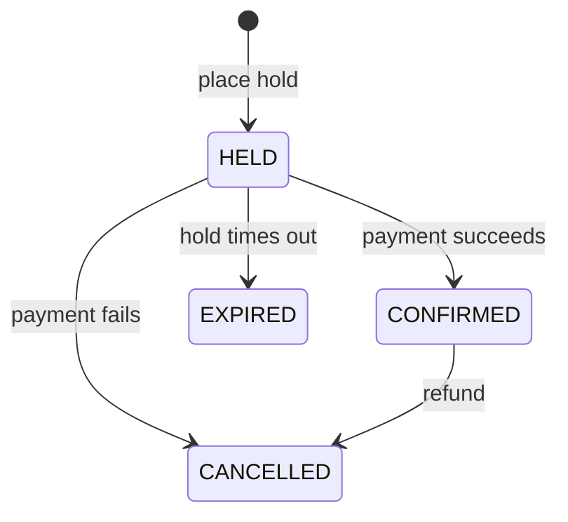

# noOverlap

A booking platform built around one hard guarantee: **a listing can never be double-booked, no matter
how many people try to reserve the same dates at the same instant.** Most reservation systems treat
that as an edge case. Here it is the organizing problem, and the correctness of the answer is proven
with a test, not asserted in a paragraph.

The stack is a NestJS modular monolith with PostgreSQL and Redis, plus one worker process extracted at
the single seam where asynchronous work is genuinely justified: charging a card. The design is
deliberately boring where boring is correct, and precise where precision matters.

## The guarantee, demonstrated

When many guests race for the same slot, exactly one wins. That property is enforced by a PostgreSQL
exclusion constraint, so it holds at the database level rather than depending on application code
getting the timing right. An integration test fires a storm of concurrent bookings at a single slot
and checks the outcome twice:

- Over HTTP: one request returns `201 Created`, every other returns `409 Conflict`.
- In the database: exactly one active reservation exists for that listing afterward.

At one hundred concurrent requests the result is one success, ninety-nine conflicts, and a single row.
The mechanism, and why the obvious alternatives race, is written up in
[docs/concepts/no-overlap.md](docs/concepts/no-overlap.md).

## Architecture at a glance



The monolith holds the request-path logic, where a single database transaction keeps things simple and
correct. The worker owns the one job that must not run inside an HTTP request or a database
transaction: talking to a payment provider. A transactional outbox connects the two so an intent to
charge is never lost, even if a process dies at the wrong moment — and because delivery is
at-least-once, every step across that boundary is built to be safe to repeat. The full reasoning is in
[docs/architecture/](docs/architecture/), and the seam itself in
[docs/concepts/async-seam.md](docs/concepts/async-seam.md).

## How a booking works

A reservation moves through an explicit state machine. A guest places a hold, which reserves the slot
for a short window. Payment confirms it; failure or a timeout releases it. Every transition is guarded
and safe to repeat, which is what makes the system correct when a message arrives twice.



The lifecycle, compensation, and idempotency are covered in
[docs/concepts/booking-lifecycle.md](docs/concepts/booking-lifecycle.md).

## Tech

| Layer    | Choice                                                         |
| -------- | -------------------------------------------------------------- |
| Backend  | NestJS, TypeScript                                             |
| Database | PostgreSQL (exclusion constraints, range types)                |
| ORM      | Prisma, with a raw SQL migration for the exclusion constraint  |
| Queue    | BullMQ on Redis                                                |
| Auth     | JWT access + refresh (RS256), Argon2id password hashing        |
| Testing  | Jest, Testcontainers, supertest, a bespoke concurrency harness |
| Tooling  | Turborepo, pnpm workspaces, GitHub Actions                     |

## Running it locally

```bash
docker compose up -d      # PostgreSQL + Redis
pnpm install
pnpm --filter @no-overlap/db exec prisma migrate deploy
pnpm dev                  # the API (and web, once present)
```

The API serves an OpenAPI document at `/docs`. A Postman collection lives under `postman/`.

To run the integration suite against a throwaway PostgreSQL (started automatically via Testcontainers):

```bash
pnpm --filter api test:int
```

## Documentation

The full documentation lives in [docs/](docs/).

- [docs/architecture/](docs/architecture/) — the system shape, the request path, and the decision records.
- [docs/concepts/](docs/concepts/) — the ideas behind the core, each taught on its own page.
- [docs/architecture/decisions/](docs/architecture/decisions/) — the significant choices and why they were made.
- [docs/glossary.md](docs/glossary.md) — the vocabulary in one place.

## Status

The backend is built and tested: identity and access control, listings, the full booking lifecycle
with the concurrency guarantee, and the asynchronous payment seam — a transactional outbox, a polling
relay, and a separate worker that charges idempotently, retries transient failures, dead-letters
poison messages, and compensates with refunds.

Reservation changes are pushed to whoever is watching a listing, so a booking made in one browser
reaches another without a refresh. Delivery is best-effort by design: each event carries a
per-listing sequence number, and a client that spots a gap or reconnects re-reads from the API rather
than trusting what it holds. A stay that has ended can be reviewed once, by the guest who took it,
and listings show real ratings rather than placeholder ones.

The web client is built on top of all of it: search, listing detail, the booking flow with a live hold
countdown that resolves itself when payment settles, trips, reviews, and a host dashboard. Tracing,
load numbers, and deployment are on the roadmap. The documentation grows alongside the code.
