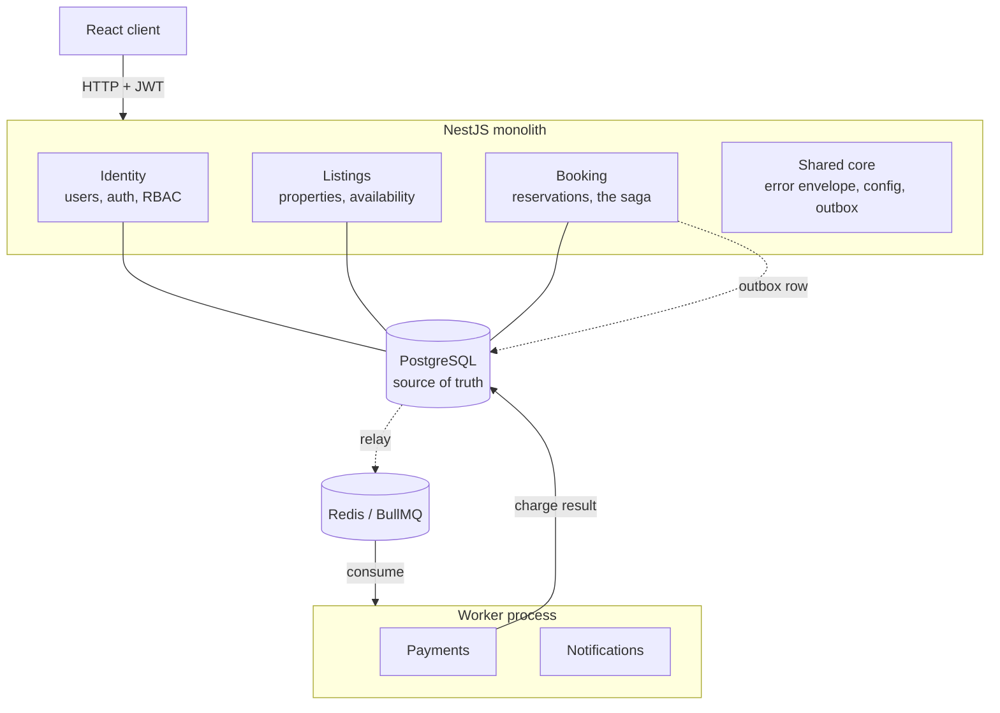
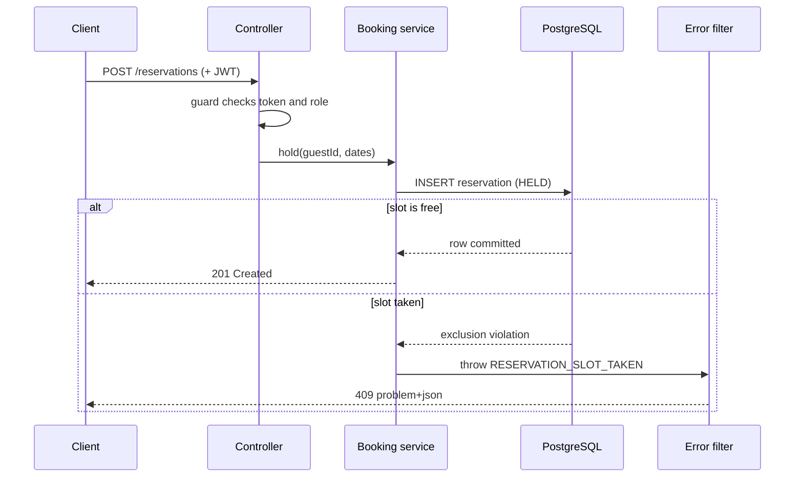
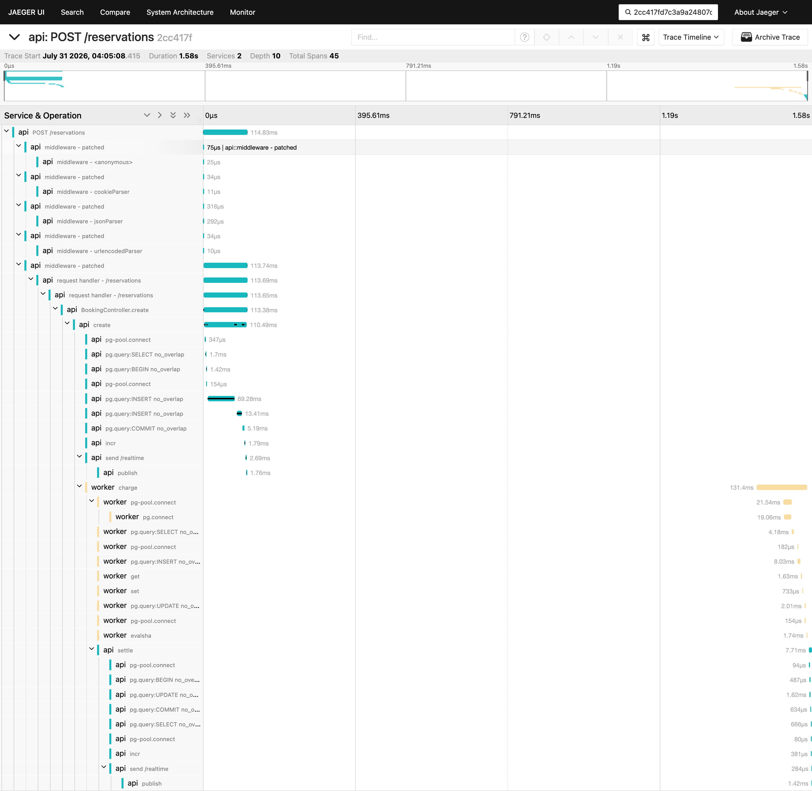

# Architecture

noOverlap is a modular monolith with one worker process split off at a single seam. This document
explains that shape, why it was chosen over the alternatives, how a request travels from the client to
the database, and where the boundaries between modules sit. The choices summarized here are recorded in
full in the [decision records](decisions/).

## The short version

Almost everything runs in one NestJS application: identity, listings, and the booking logic. Keeping
them in one process means a booking and its side effects commit in a single database transaction, which
removes a large class of distributed-systems problems before they can start. One job is pulled out into
a separate worker: charging a payment provider. That work does not belong in an HTTP request or a
database transaction, and it is the one place where an asynchronous boundary earns its cost.

## Why a modular monolith

A booking at this scale does not need a fleet of microservices. Splitting the system into independently
deployed services would buy independent scaling and deployment that the project does not need yet, in
exchange for network calls between things that used to be function calls, eventual consistency where a
transaction used to suffice, and a great deal of operational surface. The monolith keeps the request
path simple: a command handler can open a transaction, write a reservation, and record an outbox entry,
and either all of it commits or none of it does.

The design still respects module boundaries as if the pieces might one day be separated. Each module
exposes a narrow service interface and owns its own tables. Nothing reaches across a boundary into
another module's data. That discipline is what would make an extraction mechanical if it were ever
warranted, without paying for it now.

## The bounded contexts

| Module        | Owns                                                 | Notable machinery                                 |
| ------------- | ---------------------------------------------------- | ------------------------------------------------- |
| Identity      | users, password hashing, JWT access + refresh, roles | Passport strategy, guards, a `@Roles` decorator   |
| Listings      | properties, nightly pricing, availability windows    | owner-scoped CRUD                                 |
| Booking       | the reservation lifecycle, holds, the saga           | a state machine, the exclusion constraint         |
| Payments      | charging a mock provider (runs in the worker)        | idempotency keys, retry, a dead-letter queue      |
| Notifications | email and in-app messages (runs in the worker)       | queue consumer                                    |
| Shared core   | the error envelope, configuration, the outbox        | global filters and pipes, a dynamic config module |

Identity and Listings are supporting contexts. Booking is the core, and it is where the interesting
design lives.

## The request path

A typical write, placing a hold, travels through a fixed set of layers. The controller is the HTTP
boundary and does no thinking. The service holds the domain logic. Prisma is the data access layer. A
global exception filter turns any thrown domain error into a uniform response on the way out.

Two things are deliberate here. The caller's identity comes from the verified token, never from the
request body, so a client cannot act as someone else. And the service does not check availability before
inserting; it inserts and handles the database's rejection, which is what makes the operation race-free.
Both points are developed in [../concepts/no-overlap.md](../concepts/no-overlap.md) and
[../concepts/access-control.md](../concepts/access-control.md).

## The async seam

Charging a card is slow, can fail, and must never happen twice for one booking. Doing it inside the
booking transaction would hold a database transaction open across a network call to a third party;
doing it inside the HTTP request would make the guest wait on it and lose the work if the process
restarts. So the charge is handed to a worker over a queue.

The handoff uses a transactional outbox. In the same transaction that writes the `HELD` reservation, the
booking service writes a row to an outbox table describing the charge to perform. Because both writes
share one transaction, they commit together or not at all: there is no state where the reservation
exists but the intent to charge was lost, and none where a charge was queued for a booking that rolled
back. A relay reads unpublished outbox rows and pushes them onto the queue; the worker consumes them,
charges the provider with an idempotency key, and publishes the result onto a second queue, which the
API consumes to move the reservation to `CONFIRMED` or `CANCELLED`.

Delivery is at-least-once, and idempotency is what makes that safe. Two layers protect the money: a
unique idempotency key on the payments table prevents a duplicate payment record, and the same key is
passed to the provider, so a crash between charging and recording the result cannot take the money a
second time. Transient provider faults retry with exponential backoff, a declined card compensates by
releasing the hold, and a job that exhausts its retries moves to a dead-letter queue rather than looping
or disappearing. Compensation runs the same path in reverse: releasing a paid booking asks the worker to
refund it, keyed by the charge it reverses.

The mechanism, and the failure cases that shaped it, are covered in
[../concepts/async-seam.md](../concepts/async-seam.md). The decisions behind it are recorded in
[decisions/0004-transactional-outbox.md](decisions/0004-transactional-outbox.md),
[decisions/0005-bullmq-worker-transport.md](decisions/0005-bullmq-worker-transport.md), and
[decisions/0007-polling-relay.md](decisions/0007-polling-relay.md).

## The web client

A React application talks to the API over the same origin, so the refresh cookie needs no cross-origin
arrangement. Server data is treated as a cache rather than as state: queries are keyed, invalidated by
the mutations that make them stale, and — where a value is still changing — re-read on an interval
that stops itself once it cannot change again.

Two decisions there are worth surfacing, because both are visible in how the application behaves.

The access token is held in memory and never written to storage, so a script injected into the page
has nothing durable to steal; a reload asks for a fresh one using the httpOnly refresh cookie, and a
single shared request prevents parallel refreshes from tripping the server's replay detection. The
reasoning is in [decisions/0015-client-token-handling.md](decisions/0015-client-token-handling.md).

Booking is never shown optimistically. Because exactly one guest can win a slot, losing is an ordinary
outcome rather than a fault, so the interface shows the hold and its deadline and waits for the real
answer instead of asserting one and retracting it. Notably there is no confirm button anywhere: a
reservation is confirmed by the payment result arriving from the worker, and an endpoint that once let
a guest confirm their own booking was removed when building the client revealed it bypassed payment
altogether. That side of the seam is described in
[../concepts/showing-async-work.md](../concepts/showing-async-work.md), and the stack choices in
[decisions/0014-frontend-stack.md](decisions/0014-frontend-stack.md).

## The realtime seam

A second seam runs the other way. When a reservation changes, a gateway announces it to the clients
watching that listing, over a socket, through Redis so the announcement reaches sockets connected to
any instance rather than only the one that handled the request.

It is deliberately unlike the queue seam next to it. Those messages are durable because losing a
charge is unacceptable; these are emitted directly and may be lost, because losing a notification
costs a refresh. What makes that safe is that an event carries no booking detail — only that something
on a listing changed, plus a number that increases per listing. A client treats it as a prompt to
re-read from the API, and a client that spots a gap in those numbers, or that reconnects, re-reads
rather than trusting what it holds.

Polling did not go away. It remains the guarantee that a screen settles; the socket only shortens the
wait. The full reasoning is in [../concepts/realtime-updates.md](../concepts/realtime-updates.md) and
[decisions/0016-realtime-transport.md](decisions/0016-realtime-transport.md).

## Data model

The load-bearing tables are `users`, `listings`, `availability_blocks`, `reservations`, `payments`,
`reviews`, and `outbox`. A few conventions run throughout: money is stored as integer cents, never a floating-point
value, so arithmetic is exact; every timestamp is stored with its time zone; and response objects are
projections that select only the fields meant to leave the API, so an internal column cannot be
serialized to a client by accident.

Two foreign keys carry a rule rather than just a reference. A review points at the reservation that
earned it, uniquely, so one stay yields at most one review without the application having to check.
And reservations restrict deletion of their listing instead of cascading from it, so a host removing a
property cannot destroy the bookings and payments recorded against it — withdrawing a listing from
sale is a separate operation, described in
[decisions/0019-listings-are-deactivated-not-deleted.md](decisions/0019-listings-are-deactivated-not-deleted.md).

The vocabulary is collected in [../glossary.md](../glossary.md).

## Observability

One booking, one trace, across both processes:

Read left to right it is the whole design in one picture. The request opens a transaction, writes the
reservation and its event together, and commits. A gap follows — that is the relay's polling interval,
real latency the outbox costs and worth seeing rather than hiding. Then `charge` appears under a
different service name, because it is a different process. Beneath it sit the payment ledger writes
that make the charge idempotent. Then `settle` crosses back to the API, moves the reservation to
confirmed, and the guest's browser is notified, all still inside the same trace.

Getting there took work that the picture makes look automatic. Instrumentation follows an HTTP request
happily and stops dead at a queue, because the connection ends there; the context has to be carried in
the message and re-established on the other side. That is what the `traceContext` field on every
message is for, and it was reserved when the seam was first built precisely so that adding tracing
later would not be a breaking change to a schema both processes validate. The reasoning is in
[decisions/0008-trace-context-propagation.md](decisions/0008-trace-context-propagation.md), and the
backend choice in [decisions/0020-tracing-backend.md](decisions/0020-tracing-backend.md).

Two details are load-bearing and easy to get wrong. The context is captured in the request that makes
the booking, not in the relay that publishes it — the relay runs on a timer in a context of its own,
seconds later, and injecting there would parent the charge to the timer and split one booking into two
unrelated traces. And the tracing library must load before anything it instruments: it patches the
HTTP, Postgres, and Redis clients as they are required, so an import that lands earlier is captured
unpatched and simply produces no spans.

A trace explains one booking in depth. The other half of knowing what the system is doing is a handful
of numbers about all of them, which the API reports on a scrape endpoint in the standard Prometheus
format.

The four it publishes were each chosen because something had already gone wrong without them. The
outbox depth is the seam's vital sign: under load it climbed into the thousands while the booking
endpoint posted its best latency of the run, because the endpoint does not slow down when the relay
falls behind. Queue depths separate "nothing is happening" from "nothing is consuming", which look
identical in logs and once hid a dead worker for an afternoon. Booking outcomes, split by whether the
guest got the slot, make contention visible. And a counter of holds retried after a database deadlock
measures something otherwise unobservable, since a retry that succeeds writes nothing at all.

Values held in Postgres and Redis are read when the endpoint is called rather than on a timer, so an
endpoint nobody scrapes costs nothing. There is deliberately no metrics server and no dashboard: on a
single host those would stand beside the thing they monitor and share its failure modes. The format is
the one a scraper expects, so adding one later is configuration rather than code —
[decisions/0022-metrics-endpoint.md](decisions/0022-metrics-endpoint.md) has the reasoning.

## Deployment

The deployment topology — the API, the worker, PostgreSQL, and Redis as a set of containers behind a
reverse proxy — is on the roadmap and will be documented when it lands.
