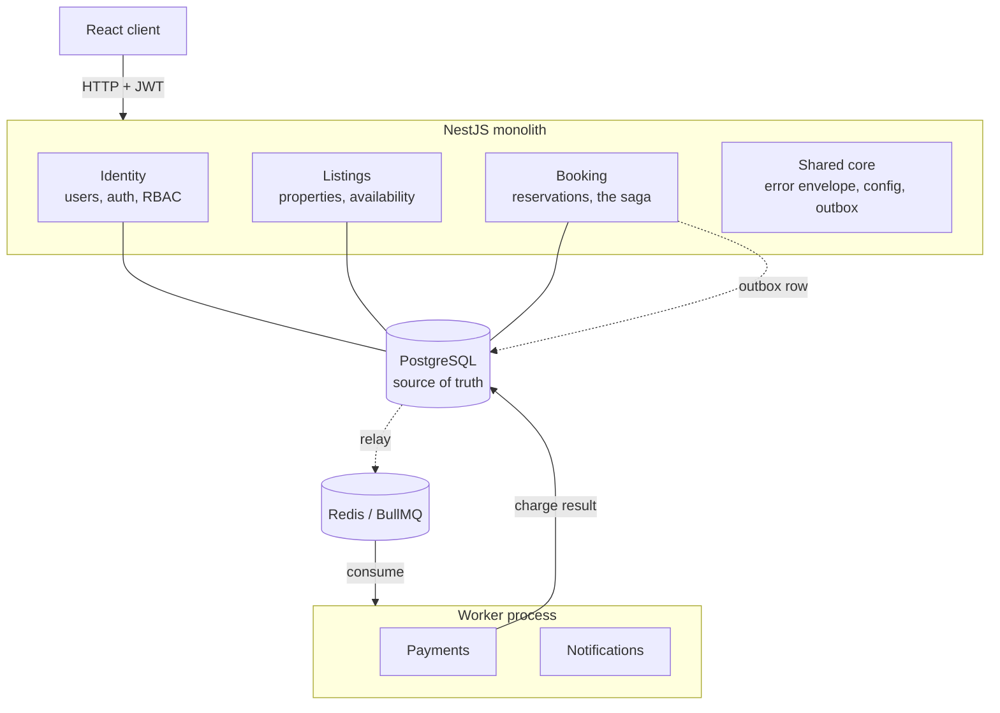
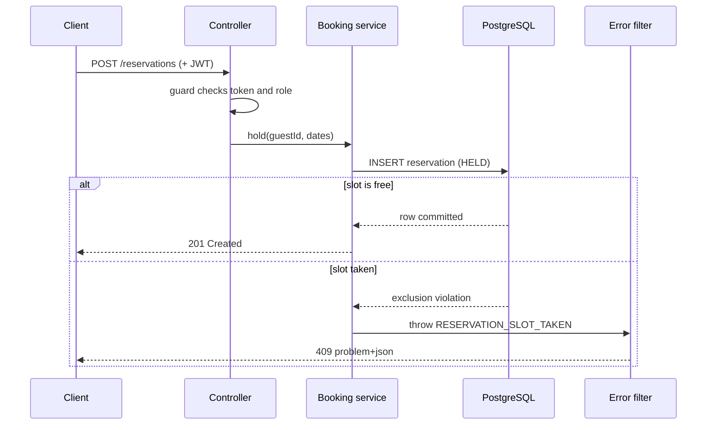

# Architecture

noOverlap is a modular monolith with one worker process split off at a single seam. This document
explains that shape, why it was chosen over the alternatives, how a request travels from the client to
the database, and where the boundaries between modules sit. The choices summarized here are recorded in
full in the [decision records](decisions/).

## The short version

Almost everything runs in one NestJS application: identity, listings, and the booking logic. Keeping
them in one process means a booking and its side effects commit in a single database transaction, which
removes a large class of distributed-systems problems before they can start. One job is pulled out into
a separate worker: charging a payment provider. That work does not belong in an HTTP request or a
database transaction, and it is the one place where an asynchronous boundary earns its cost.

## Why a modular monolith

A booking at this scale does not need a fleet of microservices. Splitting the system into independently
deployed services would buy independent scaling and deployment that the project does not need yet, in
exchange for network calls between things that used to be function calls, eventual consistency where a
transaction used to suffice, and a great deal of operational surface. The monolith keeps the request
path simple: a command handler can open a transaction, write a reservation, and record an outbox entry,
and either all of it commits or none of it does.

The design still respects module boundaries as if the pieces might one day be separated. Each module
exposes a narrow service interface and owns its own tables. Nothing reaches across a boundary into
another module's data. That discipline is what would make an extraction mechanical if it were ever
warranted, without paying for it now.

## The bounded contexts

| Module        | Owns                                                 | Notable machinery                                 |
| ------------- | ---------------------------------------------------- | ------------------------------------------------- |
| Identity      | users, password hashing, JWT access + refresh, roles | Passport strategy, guards, a `@Roles` decorator   |
| Listings      | properties, nightly pricing, availability windows    | owner-scoped CRUD                                 |
| Booking       | the reservation lifecycle, holds, the saga           | a state machine, the exclusion constraint         |
| Payments      | charging a mock provider (runs in the worker)        | idempotency keys, retry, a dead-letter queue      |
| Notifications | email and in-app messages (runs in the worker)       | queue consumer                                    |
| Shared core   | the error envelope, configuration, the outbox        | global filters and pipes, a dynamic config module |

Identity and Listings are supporting contexts. Booking is the core, and it is where the interesting
design lives.

## The request path

A typical write, placing a hold, travels through a fixed set of layers. The controller is the HTTP
boundary and does no thinking. The service holds the domain logic. Prisma is the data access layer. A
global exception filter turns any thrown domain error into a uniform response on the way out.

Two things are deliberate here. The caller's identity comes from the verified token, never from the
request body, so a client cannot act as someone else. And the service does not check availability before
inserting; it inserts and handles the database's rejection, which is what makes the operation race-free.
Both points are developed in [../concepts/no-overlap.md](../concepts/no-overlap.md) and
[../concepts/access-control.md](../concepts/access-control.md).

## The async seam

Charging a card is slow, can fail, and must never happen twice for one booking. Doing it inside the
booking transaction would hold a database transaction open across a network call to a third party;
doing it inside the HTTP request would make the guest wait on it and lose the work if the process
restarts. So the charge is handed to a worker over a queue.

The handoff uses a transactional outbox. In the same transaction that writes the `HELD` reservation, the
booking service writes a row to an outbox table describing the charge to perform. Because both writes
share one transaction, they commit together or not at all: there is no state where the reservation
exists but the intent to charge was lost, and none where a charge was queued for a booking that rolled
back. A relay reads unpublished outbox rows and pushes them onto the queue; the worker consumes them,
charges the provider with an idempotency key, and publishes the result onto a second queue, which the
API consumes to move the reservation to `CONFIRMED` or `CANCELLED`.

Delivery is at-least-once, and idempotency is what makes that safe. Two layers protect the money: a
unique idempotency key on the payments table prevents a duplicate payment record, and the same key is
passed to the provider, so a crash between charging and recording the result cannot take the money a
second time. Transient provider faults retry with exponential backoff, a declined card compensates by
releasing the hold, and a job that exhausts its retries moves to a dead-letter queue rather than looping
or disappearing. Compensation runs the same path in reverse: releasing a paid booking asks the worker to
refund it, keyed by the charge it reverses.

The mechanism, and the failure cases that shaped it, are covered in
[../concepts/async-seam.md](../concepts/async-seam.md). The decisions behind it are recorded in
[decisions/0004-transactional-outbox.md](decisions/0004-transactional-outbox.md),
[decisions/0005-bullmq-worker-transport.md](decisions/0005-bullmq-worker-transport.md), and
[decisions/0007-polling-relay.md](decisions/0007-polling-relay.md).

## The web client

A React application talks to the API over the same origin, so the refresh cookie needs no cross-origin
arrangement. Server data is treated as a cache rather than as state: queries are keyed, invalidated by
the mutations that make them stale, and — where a value is still changing — re-read on an interval
that stops itself once it cannot change again.

Two decisions there are worth surfacing, because both are visible in how the application behaves.

The access token is held in memory and never written to storage, so a script injected into the page
has nothing durable to steal; a reload asks for a fresh one using the httpOnly refresh cookie, and a
single shared request prevents parallel refreshes from tripping the server's replay detection. The
reasoning is in [decisions/0015-client-token-handling.md](decisions/0015-client-token-handling.md).

Booking is never shown optimistically. Because exactly one guest can win a slot, losing is an ordinary
outcome rather than a fault, so the interface shows the hold and its deadline and waits for the real
answer instead of asserting one and retracting it. Notably there is no confirm button anywhere: a
reservation is confirmed by the payment result arriving from the worker, and an endpoint that once let
a guest confirm their own booking was removed when building the client revealed it bypassed payment
altogether. That side of the seam is described in
[../concepts/showing-async-work.md](../concepts/showing-async-work.md), and the stack choices in
[decisions/0014-frontend-stack.md](decisions/0014-frontend-stack.md).

## Data model

The load-bearing tables are `users`, `listings`, `availability_blocks`, `reservations`, `payments`, and
`outbox`. A few conventions run throughout: money is stored as integer cents, never a floating-point
value, so arithmetic is exact; every timestamp is stored with its time zone; and response objects are
projections that select only the fields meant to leave the API, so an internal column cannot be
serialized to a client by accident. The vocabulary is collected in [../glossary.md](../glossary.md).

## Observability and deployment

Messages crossing the queue carry a trace-context field so a booking can be followed from the HTTP
request into the worker as one trace rather than two unrelated fragments. The field is part of the
message contract already, reserved deliberately so that instrumenting tracing is an additive change
rather than a breaking one to a schema both processes validate; the reasoning is in
[decisions/0008-trace-context-propagation.md](decisions/0008-trace-context-propagation.md). Wiring it to
a tracing backend, and the deployment topology (the API, the worker, PostgreSQL, and Redis as a set of
containers), are on the roadmap and will be documented as they land.
