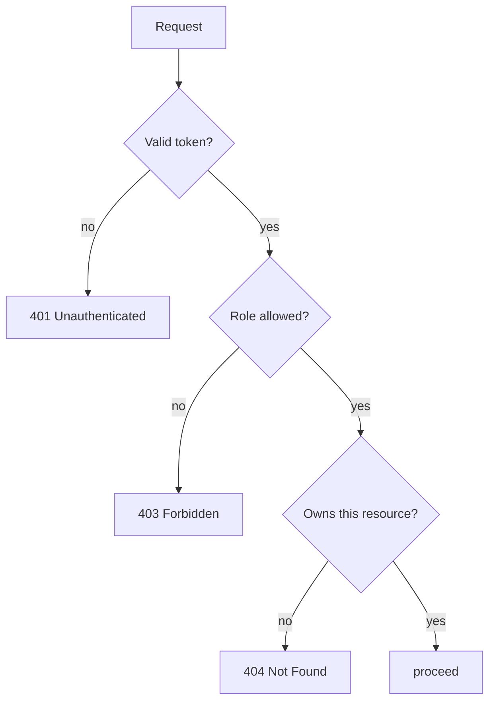

# Access control

Authentication establishes who is calling. Access control decides what they are allowed to do. These are
different questions, they fail with different status codes, and conflating them is one of the most common
sources of security bugs. noOverlap separates them into three checks that run in order: are you
authenticated, do you have the right role, and do you own the specific thing you are trying to touch.

## The short version

A request first proves its identity with a valid access token, or it is rejected with `401`. It then must
carry a role permitted for the route, or it is rejected with `403`. Finally, for actions on a specific
resource, the service checks that the caller owns that resource, and hides the resource entirely with a
`404` if they do not. The owning identity always comes from the verified token, never from the request
body, so ownership cannot be forged.

## Authentication is not authorization

A `401` means the system does not know who you are: no token, or an invalid one. A `403` means it knows
exactly who you are and the answer is still no. Returning the wrong one leaks information or confuses
clients. A route that responds `401` to an authenticated user who simply lacks permission is telling them
to log in again, which will not help. Keeping the two distinct is the starting point for everything else
here.

## Roles

Some routes are limited by role. Creating a listing is a host action; a guest cannot do it regardless of
anything else. This is role-based access control, and it is expressed declaratively. A route is annotated
with the roles it permits, and a guard reads that annotation and compares it against the role in the
caller's token. The rule lives next to the route it protects, as a small piece of metadata rather than a
branch inside the handler, so what a route requires is visible at the route.

## Ownership is the check roles cannot make

Roles answer "is this caller a host." They cannot answer "does this caller own this listing," and that is
the question that actually matters for most write operations. A host editing a listing must be editing
their own. Allowing any host to edit any host's listing would satisfy the role check and still be a
serious flaw. This is broken access control, the category that regularly tops the OWASP Top Ten, and the
reason it is so common is precisely that a role check looks like enough.

So the service performs an instance-level check: it loads the resource and confirms the caller's id
matches the resource's owner. If it does not, the service behaves as though the resource does not exist and
returns `404`, rather than `403`. A `403` would confirm that the listing exists and belongs to someone
else; a `404` reveals nothing. Hiding existence is the safer default when a caller has no business knowing
whether the resource is there at all.

## Identity comes from the token

Every one of these checks depends on the caller's identity, and that identity is read from the verified
access token, never from a field in the request body. A booking records the guest id from the token. A
listing records the host id from the token. If the owner were taken from the request, a client could claim
to be anyone by editing a JSON field, and the ownership check would be checking a value the attacker
controls. Because the token is signed and verified, the identity in it cannot be altered, which is what
makes the ownership check meaningful.

## Related reading

- [authentication.md](authentication.md) — how the identity these checks rely on is established.
- [error-model.md](error-model.md) — the shape of the `401`, `403`, and `404` responses.
