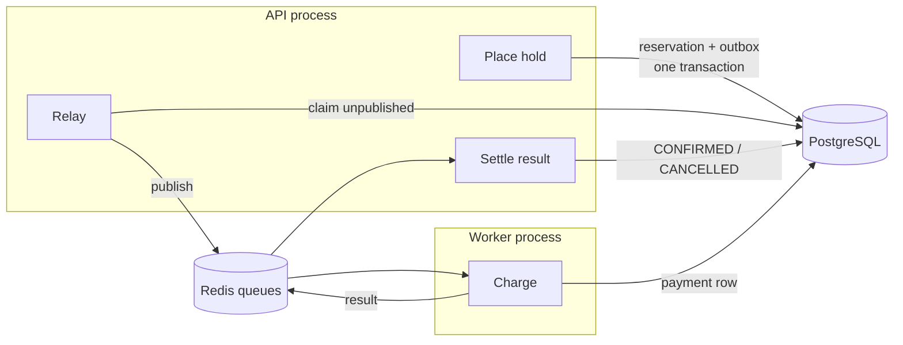

# The async seam

Charging a card is the one step in a booking that must not happen inside the HTTP request or the
database transaction. It talks to a third party, it can be slow, and it can fail in ways a database
never does. So it happens somewhere else, in its own process, after the booking has already been
safely recorded. Getting work across that boundary without ever losing it — or doing it twice — is
what this page is about.

## The short version

When a guest places a hold, the reservation and a "please charge this" event are written in the
**same database transaction**. A relay moves that event onto a queue. A separate worker process picks
it up, charges a payment provider, and publishes the result. The API consumes the result and moves
the reservation to its final state. Every step is safe to repeat, because a message may be delivered
more than once.



## The problem: two writes that must agree

The obvious approach is to save the booking and then publish a message. That is two writes to two
different systems, and nothing makes them atomic. If the process dies in between, the booking exists
and nobody will ever charge for it. Publishing first is worse: the message can announce a booking
whose transaction then rolls back, and a card gets charged for a reservation that does not exist.

This is the **dual-write problem**, and it has no solution at the application level. You cannot make
two systems commit together by being careful about ordering.

## The outbox

The fix is to stop writing to two systems. The event is written to the _same database_ as the
booking, in the same transaction, as an ordinary row:

```sql
BEGIN;
  INSERT INTO reservations (...);   -- the booking
  INSERT INTO outbox (...);         -- "please charge this"
COMMIT;
```

Both rows commit or neither does. There is no window. A reservation without its event is now
impossible, and so is an event for a booking that never existed — if the exclusion constraint rejects
an overlapping hold, the whole transaction rolls back and no phantom charge is queued.

The message broker is no longer part of the booking's correctness. It became a delivery detail.

## The relay

Something has to move those rows onto the queue. A relay polls for unpublished rows, publishes them,
and marks them sent:

```sql
SELECT id, type, payload
  FROM outbox
 WHERE published_at IS NULL
 ORDER BY created_at
 LIMIT 100
   FOR UPDATE SKIP LOCKED;
```

`SKIP LOCKED` is the important part. Without it, two relays running at once would contend for the
same rows — either blocking each other or publishing the same event twice. With it, each claims rows
the other has not, so they process disjoint batches and neither waits.

Polling has a cost: a small delay, and queries that usually find nothing. The alternative is to tail
the database's replication log, which is faster but brings replication slots and their operational
burden. Polling was chosen deliberately as the boring, operable option, with log-tailing noted as the
upgrade path if latency ever justifies it.

**The ordering inside the relay is deliberate: publish first, mark second.** If the process dies
between the two, the row stays unpublished and is sent again on the next pass. The alternative
ordering — mark, then publish — loses the event entirely if the crash lands in the gap. Sending twice
is a problem you can solve. Never sending is not.

## At-least-once, and the honesty it requires

That decision has a consequence worth stating plainly: **delivery is at-least-once, not exactly-once.**
A message can arrive twice. Queues do not offer exactly-once delivery in any meaningful sense, and
systems that claim it are usually describing at-least-once delivery plus a consumer that deduplicates.

So the consumer deduplicates. Every step across this seam is built to be repeatable:

- Charging is keyed by an **idempotency key** derived from the reservation, so a redelivered message
  settles against the same payment rather than opening a second one.
- Confirming uses a conditional update (`WHERE status = 'HELD'`), so a repeat changes nothing.
- A result for an already-settled booking is reported as ordinary, not raised as an error.

## Two layers protect the money

The unique `idempotency_key` on the payments table stops a second payment row from being created. It
is not enough on its own. Consider:

1. The worker records a pending payment.
2. It calls the provider. **The card is charged.**
3. The worker crashes before it can record the result.
4. The message is redelivered. The row still says pending.

If the only check were "is my row settled?", the honest answer is no — and charging again would take
the money twice. The row records what _we_ know; it cannot know what the provider did in the gap.

That is why the same idempotency key is also sent **to the provider**, which recognises it and returns
the original charge instead of making a new one. This is exactly why real payment APIs accept an
idempotency key on every request.

> The database row is our _record_ of the charge. The key given to the provider is what protects the
> _money_.

## Failures worth telling apart

Not every failure means the same thing, and treating them alike gets one of them wrong:

| Failure                       | Meaning                             | Response                       |
| ----------------------------- | ----------------------------------- | ------------------------------ |
| Provider unreachable, timeout | Transient — it may work in a moment | Retry with exponential backoff |
| Card declined                 | Terminal — retrying changes nothing | Compensate: release the hold   |

The distinction is encoded in control flow rather than a status field: a transient fault **throws**,
which the queue reads as "run this again later", while a decline **returns** a result, which completes
the job. A caller cannot forget to check which kind it is holding.

Retries are finite. A job that exhausts them is moved to a **dead-letter queue** with its payload and
failure reason, rather than retrying forever or vanishing. Notably, that job does _not_ cancel the
booking: a charge that ran out of retries has an unknown outcome, and releasing a slot the guest may
have paid for would be its own kind of bug. The hold is left for the expiry sweep to reclaim, and the
evidence is kept for a human.

## Compensation

Because payment happens after the booking is recorded, some bookings must be undone. That is the
saga pattern: a sequence of steps where each has an action that reverses it.

- **Payment declined** → the hold moves to cancelled, which frees the slot immediately, since the
  no-overlap constraint only counts live bookings.
- **Guest cancels a paid booking** → the reservation is released _and_ a refund is requested.
- **Charge succeeds but the hold already expired** → money moved with no booking to show for it, so a
  refund is issued rather than reviving a slot that has since been given away.

Refunds mirror charges exactly: the API requests one, the worker performs it against the provider,
and it is keyed by the same idempotency key — so a redelivered refund replays instead of paying the
guest back twice.

## What this buys

The request path stays fast and fully transactional. The unreliable work happens where it is allowed
to fail, retry, and recover. A crash anywhere in the chain costs a duplicate message, never a lost
booking or a double charge. And because exactly one boundary was drawn — at the one place where
asynchronous processing is genuinely justified — the rest of the system keeps the simplicity of a
single transaction.

## Related reading

- [booking-lifecycle.md](booking-lifecycle.md) — the state machine the payment results drive.
- [no-overlap.md](no-overlap.md) — why releasing a hold frees the slot with no extra bookkeeping.
- [testing.md](testing.md) — how the relay's concurrency and crash behaviour are proven.
