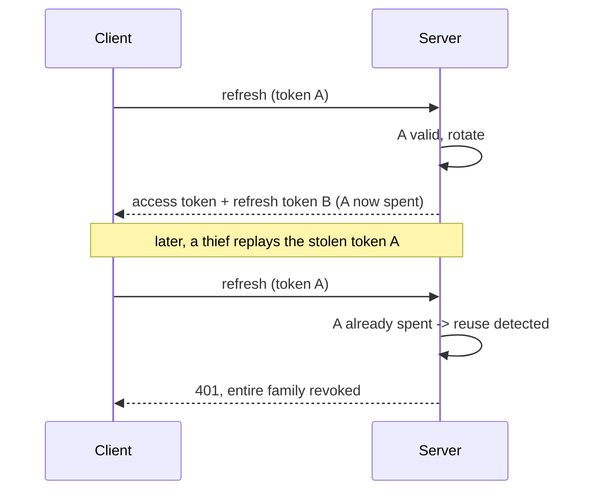

# Authentication

Authentication answers one question: who is making this request. noOverlap answers it with password
hashing that resists offline cracking, short-lived signed tokens that any part of the system can verify
without a shared secret, and long-lived refresh tokens that can be revoked the moment they are misused.
This page covers each piece and the attack it is built against.

## The short version

Passwords are hashed with Argon2id and never stored or logged in the clear. A successful login returns a
short-lived access token, a signed JWT the client sends on every request, plus a long-lived refresh
token kept in an `HttpOnly` cookie. The access token is signed with RS256, so a private key mints tokens
and a public key verifies them. Refresh tokens are stored in the database as hashes and rotated on every
use, which turns a stolen token into a detectable, revocable event.

## Password storage

A password database is worthless to an attacker only if the stored form cannot be turned back into the
password. That rules out storing passwords, and it rules out fast hashes, because a fast hash is fast for
the attacker too. The defense is a slow, memory-hard hash.

noOverlap uses Argon2id. It is memory-hard, meaning cracking it in parallel on a GPU or custom hardware
requires large amounts of memory per guess, which is exactly the resource such hardware lacks. Its cost
is tunable, so it can be made slower as hardware improves. The common alternative, bcrypt, is a
reasonable hash but is not memory-hard and silently truncates input past seventy-two bytes. Only the hash
is ever persisted, and the plaintext is never written to a log.

## Access tokens

An access token is a JSON Web Token: three parts, a header, a payload of claims, and a signature. It is
signed, not encrypted, which means it carries no secrets and anyone can read its contents; the signature
proves the token was issued by this system and has not been altered. The server verifies the signature
and trusts the claims inside, so it can authenticate a request without a database lookup. That statelessness
is the point, and it is why the token is short-lived: a stolen one stops working within minutes.

The signature uses RS256, an asymmetric algorithm. A private key signs; a separate public key verifies.
Only the code that issues tokens needs the private key, and any component that merely checks tokens needs
only the public one, which cannot mint anything. A symmetric algorithm like HS256 uses the same secret to
sign and verify, so every verifier would hold the power to forge.

Choosing asymmetric signing also closes an algorithm-confusion attack, but only if the verifier is strict
about the algorithm. The token verification is pinned to `RS256`. Without that pin, an attacker can change
the token header to `alg: none` and present an unsigned token, or set it to `HS256` and sign with the
public key, which is public, as if it were an HMAC secret. Accepting only `RS256` refuses both.

## Refresh tokens and rotation

Access tokens expire quickly, which would force a login every few minutes. The refresh token solves that:
it is long-lived and its only job is to obtain new access tokens. Because it is long-lived, it is the more
dangerous credential, so it is handled with more care than the access token.

It is kept in an `HttpOnly`, `Secure`, `SameSite` cookie. `HttpOnly` puts it out of reach of JavaScript,
so a cross-site scripting flaw cannot read it. `SameSite` limits when the browser attaches it to requests,
which blunts cross-site request forgery. And it is stored server-side as a hash, so the database never
holds anything an attacker could replay.

The defining feature is rotation. Every time a refresh token is used, it is invalidated and a new one is
issued. A refresh token is therefore single-use. This is what makes theft detectable: if an old,
already-rotated token is presented again, either the legitimate user or an attacker is replaying a spent
credential, and that is a signal. The system treats it as a compromise and revokes the entire token
family, the chain of tokens descended from that login, so both the thief and the victim are logged out and
must authenticate again.

A stateless refresh token could not do this. Its whole appeal is that the server holds no record of it,
which also means the server cannot revoke it before it expires. Persisting refresh tokens trades a small
amount of storage and a database lookup for the ability to detect and stop theft.

## Login and lockout

Two smaller defenses sit around the login endpoint. An unknown email and a wrong password return the same
error, and the server runs a password verification in both cases, hashing against a dummy value when no
user exists. Without that, an attacker could tell which emails are registered by timing the response, since
a missing user would skip the expensive hash and answer faster. Equalizing the work removes the tell.

The auth endpoints are also rate-limited, so an attacker cannot try passwords as fast as the network
allows. When the limit is exceeded the response is the same standard error shape as everything else, which
is covered in [error-model.md](error-model.md).

## Related reading

- [access-control.md](access-control.md) — once a request is authenticated, deciding what it may do.
- [error-model.md](error-model.md) — how authentication failures are reported.
