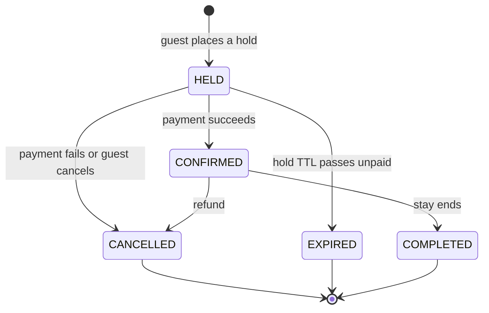

# The booking lifecycle

A booking is not a single write. It starts when a guest commits to dates, and it ends only after a
payment succeeds, fails, or never arrives. In between, the slot is held but not paid for, and the system
has to handle every way that can resolve. Modeling this as an explicit state machine, rather than a
tangle of boolean flags and conditionals, is what keeps the behavior correct and legible.

## The short version

A reservation has a status, and it moves between statuses along a fixed set of legal transitions. A
`HELD` reservation is a short-lived claim on a slot. Payment moves it to `CONFIRMED`. A failure or a
cancellation moves it to `CANCELLED`. A hold that is never paid for moves to `EXPIRED` on its own. Only
`HELD` and `CONFIRMED` reservations occupy a slot, so cancelling or expiring one frees the dates without
deleting anything. Every transition is guarded and safe to repeat.



## Why a hold, and why a time limit

If booking were a single step, a guest would have to pay in the same instant they choose dates, and the
slot would be locked while an external payment provider is contacted. Neither is acceptable. So a
reservation is created in a `HELD` state first: the dates are claimed, and the guest has a bounded
window to complete payment. The claim is real, so no one else can take the slot, but it is temporary, so
an abandoned checkout cannot lock a listing forever.

The bound is a timestamp, `hold_expires_at`, set when the hold is created. A background sweep runs on a
schedule and moves any `HELD` reservation past its deadline to `EXPIRED` with a single statement:

```sql
UPDATE reservations
   SET status = 'EXPIRED'
 WHERE status = 'HELD'
   AND hold_expires_at < now();
```

One set-based update is atomic and idempotent. Running it twice changes nothing the second time, and two
instances running it at once cannot double-process a row, because expiring is a pure status change with
no side effect. If an expiry ever needed to do more than flip a column, the sweep would instead claim
rows with `SELECT ... FOR UPDATE SKIP LOCKED` so instances take disjoint batches. It does not need that
yet, and adding it now would be complexity without a cause.

## The transition map is the only authority

Which moves are legal lives in one place, a map from a status to the statuses it may become:

```
HELD      -> CONFIRMED, CANCELLED, EXPIRED
CONFIRMED -> CANCELLED, COMPLETED
CANCELLED -> (terminal)
EXPIRED   -> (terminal)
COMPLETED -> (terminal)
```

Every state change is checked against this map before it happens. Confirming an expired hold, or
cancelling a completed stay, is rejected with a `409 Conflict` rather than silently allowed. Keeping the
rule in one table, instead of scattering `if (status === ...)` checks across the code, means the set of
legal transitions can be read at a glance and cannot drift out of sync with itself.

## Compensation without deletes

When a payment fails, the hold has to be undone. This is a saga: a sequence of steps where each step has
a compensating action that reverses it. The compensation for a hold is a cancel, and it is almost free,
because of how the no-overlap rule is written. The exclusion constraint that prevents double-booking only
considers `HELD` and `CONFIRMED` rows. Moving a reservation to `CANCELLED` or `EXPIRED` removes it from
that set, so the slot reopens immediately. Nothing is deleted; the row stays for history, and the
constraint simply stops counting it. The state machine and the constraint reinforce each other: one
decides what a reservation is, the other decides what occupies a slot, and they agree.

## Idempotency, and why it is not optional

Confirming an already-confirmed reservation returns the current state and does nothing else. Cancelling
an already-cancelled one does the same. These operations are idempotent by design: repeating them has the
same effect as doing them once.

This looks like a nicety until payment becomes asynchronous. A worker consuming a queue receives each
message at-least-once, which means sometimes twice. If confirming a booking were not idempotent, a
redelivered "payment succeeded" message would confirm twice, or worse. Building the transitions to be
repeatable from the start means the queue can deliver a message again without consequence, which is what
makes at-least-once delivery safe to rely on.

## The confirm-versus-expire race

Once a background sweep can change a reservation's status, confirming one has a subtle hazard. The
confirm handler reads the reservation, sees it is `HELD`, and writes `CONFIRMED`. Between the read and the
write, the sweep can expire it. A naive write would then revive a reservation the system had already given
up on.

The fix is to make the write conditional on the status it expected:

```sql
UPDATE reservations
   SET status = 'CONFIRMED'
 WHERE id = $1
   AND status = 'HELD';
```

If the row is no longer `HELD`, the update matches nothing, and the handler re-reads to see what actually
happened and responds accordingly. The check and the act are a single statement the database executes
atomically, so there is no window between them. This is the same principle behind the no-overlap
guarantee, applied to a different write: do not check and then act; act in a way the database can reject.

## Related reading

- [no-overlap.md](no-overlap.md) — how a slot is protected against concurrent bookings in the first place.
- [testing.md](testing.md) — how these transitions are verified against a real database.
