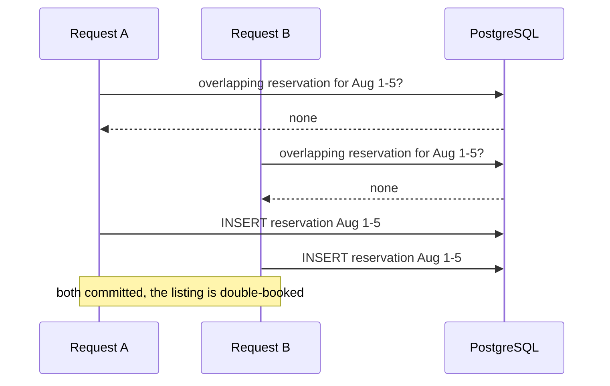
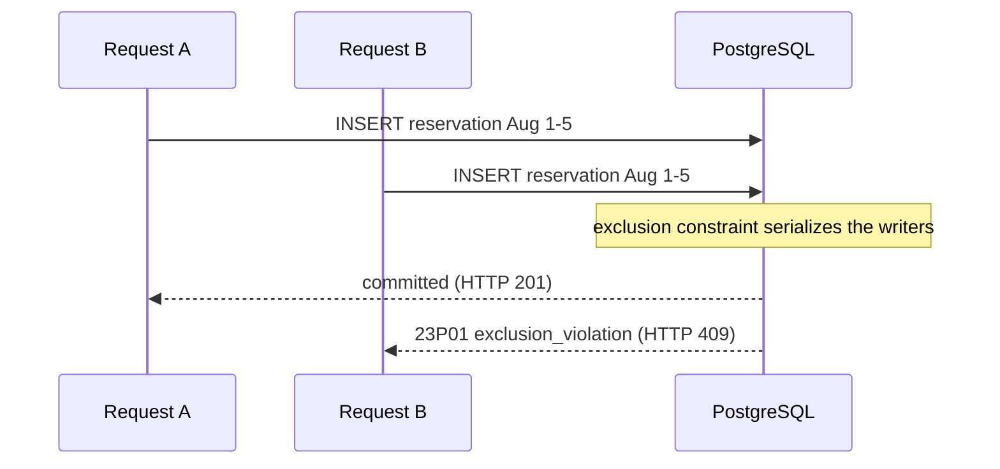

# Preventing double-booking

The core promise of a booking system is easy to state and hard to keep: when two guests try to book
the same place for overlapping dates at the same instant, exactly one of them can win. This page
explains how that promise is kept, why the obvious solutions break under load, and how the guarantee
is proven rather than asserted.

## The short version

Overlap prevention lives in the database, not in application code. A PostgreSQL exclusion constraint
on each reservation's date range makes it physically impossible to commit two overlapping active
reservations for the same listing. The application never checks whether a slot is free before taking
it. It attempts the insert and lets the database reject the loser. Because the rule is enforced on
every write, no degree of concurrency can produce an overlap.

## The problem

A reservation holds one listing for a date range: a check-in and a check-out. Two reservations for the
same listing conflict when their ranges overlap. The interesting case is contention: many guests, the
same dates, at once.

Picture two requests reaching the server in the same millisecond, both for listing X from August 1 to
August 5, each checking whether the slot is free before taking it:



Nothing about the two requests is individually wrong. The bug is in how they interleave: both checks
run before either insert, so both see an empty slot.

## The obvious solution, and why it fails

Most first attempts check, then insert:

```
1. SELECT whether an overlapping reservation already exists  ->  none found
2. INSERT the new reservation
```

Under concurrency both requests run step 1 before either reaches step 2, so both see an empty slot and
both proceed to step 2. The window between the check and the write is the flaw. It has a name,
time-of-check to time-of-use (TOCTOU), and it is one of the most common concurrency bugs there is.

Wrapping the check and insert in a transaction does not close the window on its own; under the default
isolation level the two transactions still each see a slot with no conflicting row. You can force
correctness by locking, for example `SELECT ... FOR UPDATE` on the listing, but now every booking for a
listing serializes behind a single lock even when the requested dates do not overlap at all. That
works, and it is slower than it needs to be, and it pushes the correctness argument into application
code where the next person can get it wrong.

## The approach: make the database enforce the rule

PostgreSQL can treat "no two active reservations for one listing may overlap" as a constraint it checks
on every insert, using an exclusion constraint backed by a GiST index:

```sql
CREATE EXTENSION IF NOT EXISTS btree_gist;

ALTER TABLE reservations
  ADD CONSTRAINT no_overlapping_active_reservations
  EXCLUDE USING gist (
    listing_id                          WITH =,
    tstzrange(check_in, check_out, '[)') WITH &&
  )
  WHERE (status IN ('HELD', 'CONFIRMED'));
```

Read it as a rejection rule: refuse any row whose `listing_id` equals (`=`) that of an existing row and
whose date range overlaps (`&&`) it, considering only rows that are `HELD` or `CONFIRMED`.

Three parts make it work:

`btree_gist` lets one GiST index mix an equality test on `listing_id` with a range-overlap test on the
dates. Equality is not normally a GiST operation; the extension supplies it so both columns live in the
same index and the constraint is a single lookup.

`tstzrange(check_in, check_out, '[)')` builds the date range on the fly from the two timestamp columns.
Storing the endpoints as ordinary columns keeps them easy to read and write; the range is an expression
the index computes, so there is no separate range column to keep in sync.

The partial `WHERE (status IN ('HELD', 'CONFIRMED'))` scopes the rule to reservations that actually hold
the slot. A cancelled or expired reservation is left in the table for history but no longer blocks
anyone, because it falls outside the constraint's predicate. Freeing a slot is therefore a status
change, not a delete.

With the constraint in place, the same two requests take a different shape. Neither checks first; both
insert, and the database lets exactly one through:



Two concurrent inserts for overlapping ranges serialize at the database. One commits. The other raises
a constraint violation. There is no interval in which both succeed, because for each writer the check
and the write are one indivisible operation.

## Half-open ranges, so back-to-back stays work

The `'[)'` in the range bounds means start-inclusive, end-exclusive. A stay from the 1st to the 5th
occupies the 1st through the 4th nights and releases on the 5th. A guest checking in on the 5th does not
collide with it. Same-day turnover is a normal event in lodging, and the bounds encode it directly, so
no special case is needed in code.

## What the application does

Almost nothing, which is the point. It inserts and handles the one error that means "someone beat you to
it":

```ts
try {
  return await this.prisma.reservation.create({ data: { listingId, guestId, checkIn, checkOut, ... } });
} catch (err) {
  if (isExclusionViolation(err)) {
    throw new AppException('RESERVATION_SLOT_TAKEN'); // maps to HTTP 409
  }
  throw err; // any other failure is a real error and must not be swallowed
}
```

There is deliberately no `SELECT` beforehand. Adding one back would reintroduce the exact race the
constraint exists to remove. The insert is the check.

One detail worth knowing: the driver reports the violation as a PostgreSQL error with SQLSTATE `23P01`
(`exclusion_violation`). Matching on that code is stable across database and library versions; matching
on the human-readable message text is not, and should be avoided.

## The proof

A guarantee is only worth as much as its test. The repository includes an integration test that runs
against a real PostgreSQL instance and fires many booking requests at a single slot at once. It checks
the result at two levels:

- Over HTTP: exactly one request returns 201 Created; every other returns 409.
- In the database: exactly one active reservation exists for that listing afterward.

At one hundred concurrent requests the outcome is one success, ninety-nine conflicts, and a single row.
The database-level check is the one that matters, because the constraint makes any other outcome
impossible to write, not merely unlikely. The same harness scales to ten thousand requests to confirm
the property holds under real load, not just at small numbers.

## Alternatives, and when to reach for them

The exclusion constraint is the right tool here because the invariant is about ranges and the contention
is high. Two other approaches are worth knowing, because an interviewer will ask and because each wins in
a different situation.

Pessimistic locking (`SELECT ... FOR UPDATE`) takes a lock before writing. It is correct and
straightforward, and it serializes all writers for the locked row even when their requests would not have
conflicted. Reach for it when conflicts are the common case and the critical section is short.

Optimistic locking adds a version column and retries when a write finds the version has moved. It shines
when conflicts are rare, because the happy path takes no locks at all and pays nothing. It costs a retry
loop and degrades as contention rises.

The exclusion constraint sits apart from both: it is declarative, the database cannot be talked out of
it, and it composes across ranges in a way a single-row lock does not. That is why it owns the invariant
here, and why the application is left with nothing to do but insert and catch.

## Further reading

- PostgreSQL manual: "Constraints — Exclusion Constraints," "Range Types," and the `btree_gist` module.
- PostgreSQL error codes: class 23, `exclusion_violation` (`23P01`).
- The related concept page on the [booking lifecycle](booking-lifecycle.md), which explains how a slot
  is released when a reservation is cancelled or expires.
