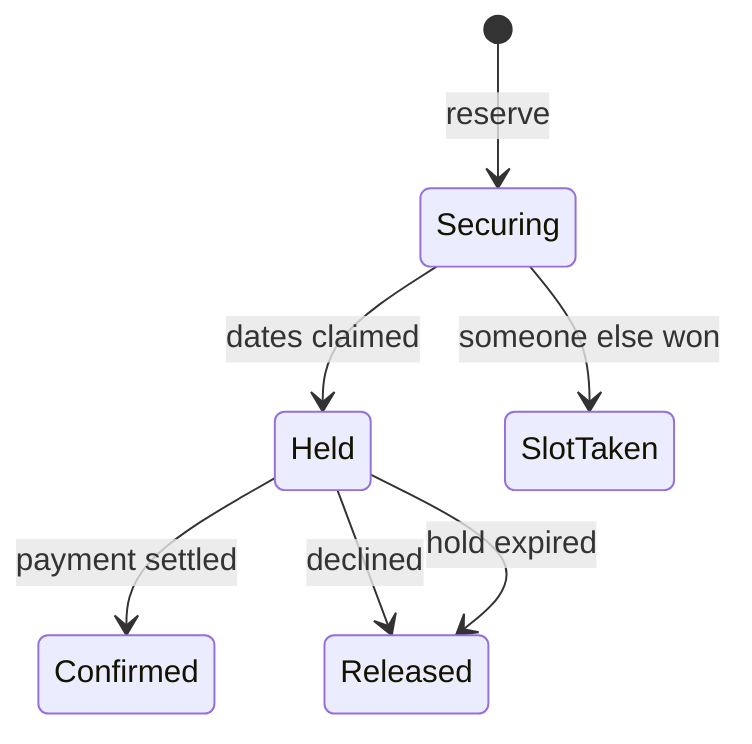

# Showing work that finishes elsewhere

Most interfaces are built on a comfortable assumption: you send a request, and the response tells you
what happened. Booking here breaks that. Reserving returns a *held* booking almost immediately, but
whether it becomes a confirmed one is decided seconds later, by a different process, after the card
has been charged. The screen has to be honest about that gap without making it feel like a fault.

## The short version

A hold is a real claim with a deadline, so the screen shows a countdown against the server's own
expiry. Confirmation arrives on its own, so the client re-reads the reservation until it settles and
then stops. Nothing is shown as confirmed before the server says so, because a booking can genuinely
be lost — and taking a confirmation back is worse than making someone wait a second for a true one.



## Why not just show success

The tempting move is an optimistic update: assume it worked, render the confirmation, and quietly
correct yourself if it didn't. That is often right — for a *like* button, the failure is rare and the
correction is cheap.

It is wrong here, and the reason is worth being precise about. This system's defining property is that
exactly one guest can win a slot, which means **losing is a normal outcome, not an error**. An
optimistic confirmation would show a booking that never existed, and then take it away. For something
a person is arranging travel around, a second of honest waiting beats an instant lie.

So the rule is: optimism is appropriate when failure is *rare and cheap*. When failure is a genuine
business outcome, show the truth and design the wait.

## Polling that knows when to stop

Nothing pushes the confirmation to the browser, so the client asks again:

```ts
refetchInterval: (query) =>
  query.state.data && !isSettled(query.state.data.status) ? 1500 : false
```

The condition is the whole idea. A reservation that has reached a terminal status will never change
again, so polling returns `false` and stops for good. A poll with no stopping condition is a tax on
the battery and the server for as long as the tab stays open — and tabs stay open for days.

This is deliberately the simple option. A pushed update over a persistent connection would be faster
and quieter, but it brings connection lifecycles, reconnection, and fan-out to every client. Polling
an endpoint that already exists, and stopping the moment it settles, is enough for a wait measured in
seconds.

## A countdown that survives a background tab

The hold has a deadline, and the screen shows how long is left. The obvious implementation — start at
fifteen minutes and subtract a second each tick — is wrong in a way that only shows up later: browsers
throttle timers in background tabs, so a counter like that falls behind and then confidently displays
a time that never existed.

Deriving it instead removes the problem:

```ts
const [now, setNow] = useState(() => Date.now());   // only the clock is state
const left = Math.max(0, new Date(expiresAt).getTime() - now);
```

Every tick re-reads the real clock and compares it to the server's own deadline. A tab that was
throttled for a minute simply shows the correct remaining time when it comes back. As a bonus, the
remaining time is no longer state that can drift out of sync with the deadline it came from — it is
derived from it, and cannot disagree.

## Losing a race is a screen, not an error toast

When another guest wins the slot, the API answers with a conflict. It would be easy to render that as
a red banner, since it is technically a failed request. But nothing malfunctioned: the system worked
exactly as designed, and this guest was second.

So it gets a proper screen — what happened, the reassurance that **no money was taken**, and a way
onward to different dates or another stay. The same applies to a declined payment and an expired hold:
each states plainly that the dates were released and nothing was charged, because that is the question
the person actually has.

## The confirm button that isn't there

The held screen says something unusual: *confirmation arrives automatically — there is no confirm
button by design.*

That sentence is the architecture surfacing in the product. Payment is settled by a separate process,
and the reservation is confirmed by that result flowing back. A button that let a guest confirm
their own booking would have to bypass payment entirely — which is exactly what an early version of
this API allowed, until building the client made the hole obvious. The endpoint was removed, and the
screen now explains why nothing is being asked of the person waiting.

## Related reading

- [async-seam.md](async-seam.md) — the machinery on the other side of that wait.
- [booking-lifecycle.md](booking-lifecycle.md) — the states this screen is rendering.
